# UltraNote

> A local-first, self-hosted personal workspace for notes, tasks, projects, journaling, and research capture — all in a single Node.js server, with a snappy vanilla-JS frontend that also installs as a PWA on your phone.

[](#license)
[](#prerequisites)
[](#stack)
[](#mobile--phone-capture)

UltraNote is the notebook I wanted but couldn't find: **all my notes in one place, owned by me, runnable on a single laptop or tiny VPS, with a real mobile capture flow**. Built for people who write a lot, read a lot, plan in projects, and want a single rolling daily page that doubles as a task inbox and journal.

If Notion feels too heavy, Obsidian too plugin-laden, and Markdown-in-VS-Code too sparse — this lives in that middle space.

> **Status & scope.** UltraNote is **single-user, local-first, and self-hosted**. There is no multi-tenant auth, no cloud sync, and no "team" mode. It runs on one Node process; you own the `data.json`. It was built for me and put in the open in case it's useful for you. PRs welcome — SaaS-style feature requests probably aren't.

<p align="center">
  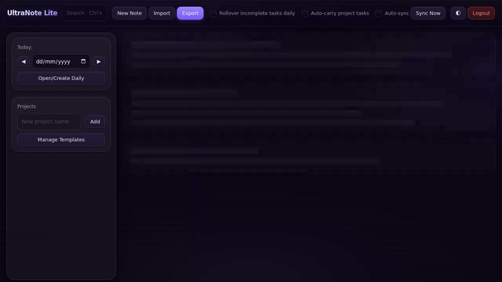<br/>
  <em><code>Alt+N</code> to capture a task, then a journal line, then <code>Ctrl+K</code> to jump to a note — no menus, no mode switches.</em>
</p>

---

## A quick look

<p align="center">
  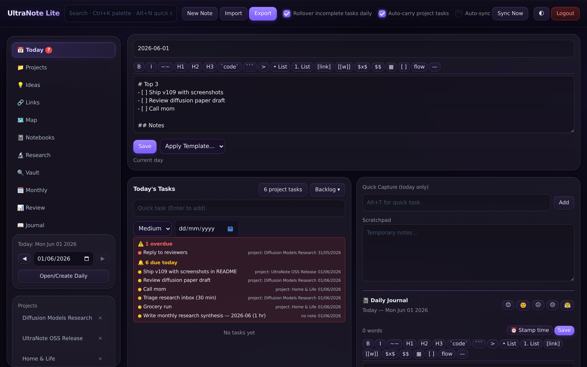<br/>
  <em>The Today view: daily note (with template), pending tasks with overdue badges, scratchpad, journal, sidebar projects.</em>
</p>

<p align="center">
  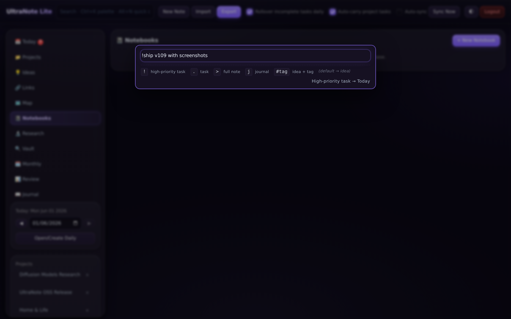
  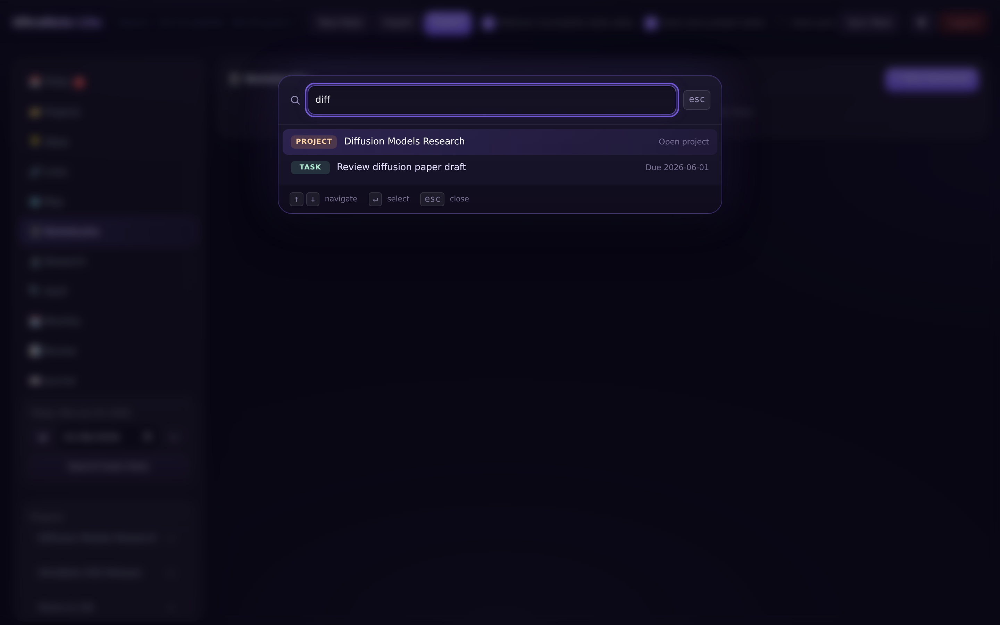<br/>
  <em>Left: <code>Alt+N</code> quick capture — the prefix decides where it lands.&nbsp; Right: <code>Ctrl+K</code> fuzzy palette across everything.</em>
</p>

<p align="center">
  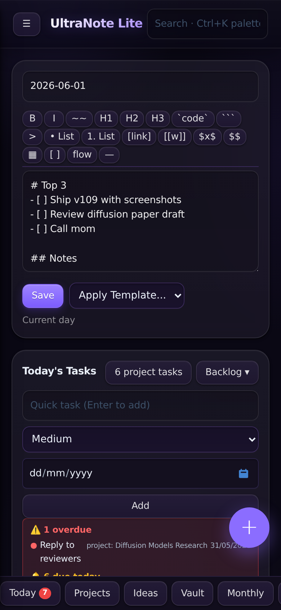
  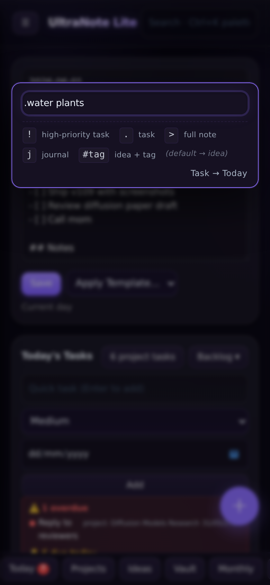
  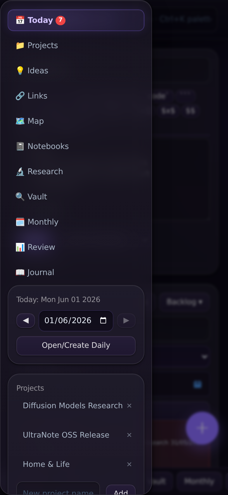<br/>
  <em>Mobile: Today view with bottom nav + FAB,&nbsp; tap-the-+ capture (full prefix legend),&nbsp; side drawer for the rest.</em>
</p>

<p align="center">
  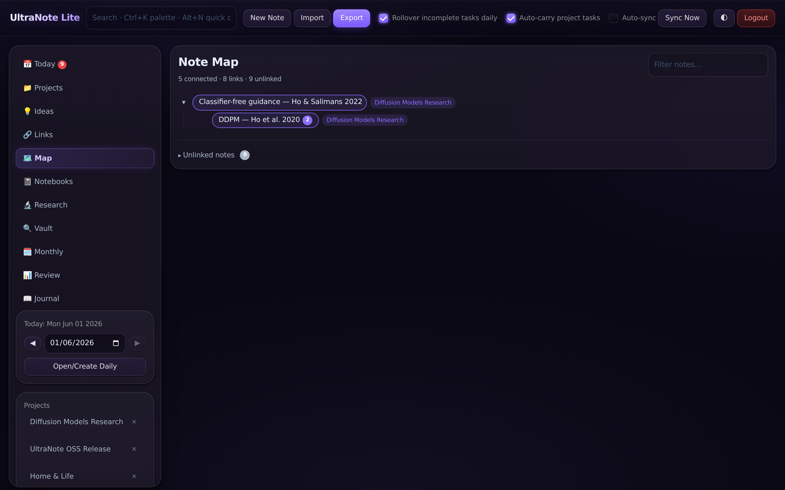
  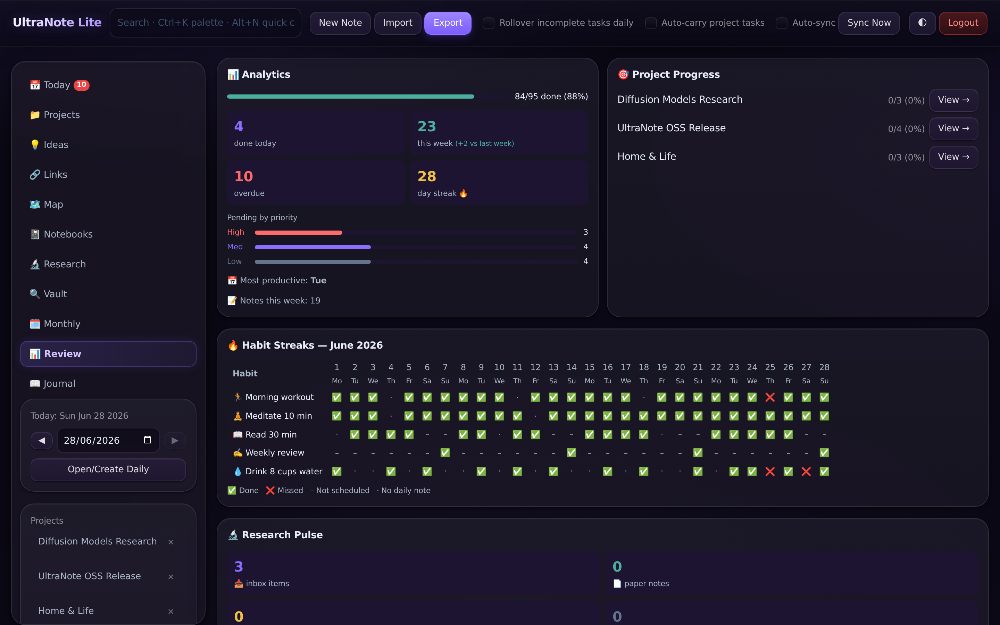<br/>
  <em>Left: the <strong>Map</strong> walks the <code>[[wiki-link]]</code> graph between your notes.&nbsp; Right: <strong>Review</strong> turns your task &amp; note history into actual analytics — streaks, project progress, weekly throughput.</em>
</p>

---

## Contents

- [Highlights](#highlights)
- [Feature tour](#feature-tour)
- [Mobile & phone capture](#mobile--phone-capture)
- [Quick start](#quick-start)
- [Configuration](#configuration)
- [Data, backups, and the two-repo pattern](#data-backups-and-the-two-repo-pattern)
- [Keyboard shortcuts](#keyboard-shortcuts)
- [Architecture](#architecture)
- [Data model](#data-model)
- [API](#api)
- [Security](#security)
- [Troubleshooting](#troubleshooting)
- [Contributing](#contributing)
- [License](#license)

---

## Highlights

- **Single rolling daily page** with template, scratchpad, task inbox, journal, and automatic rollover of incomplete tasks.
- **Project-aware tasks** with TODO / DONE / BACKLOG, due dates, priorities, recurring schedules, and per-project task carry-forward.
- **Quick capture with prefix routing** (desktop `Alt+N`, mobile `+` FAB) — type one character to decide where it lands:
  - `!` high-priority task · `.` normal task · `>` full note · `j` today's journal · `#tag` idea with tag · _(no prefix)_ → idea
- **🔬 Research mode**: silent inbox capture from a bookmarklet, **arXiv auto-parsing**, **topic-map picker** to file straight into the right project, and one-click undo.
- **📓 Notebooks** with multi-page markdown editing, **`[[wiki-links]]`** between notes (with alias support), and a **Map** view of the knowledge graph.
- **� Monthly recurring habits + streak grid** — define a habit once (every day, weekdays only, Sundays, custom set), toggle it on Today, and the **Review** page renders a calendar heatmap of every ✅ / ❌ for the current month.
- **�🔍 Vault** — fast global search across notes, tasks, projects, links, and tags.
- **Command palette** (`Ctrl+K`) for instant fuzzy navigation, with materialized-recurring-task dedup so the list stays readable.
- **Mobile-first PWA** — install to home screen, bottom nav bar, side-drawer tools, browser back-button works in-app, share-target capture from any other Android app via [HTTP Shortcuts](#mobile--phone-capture).
- **100% local-first** — all data lives in a single `data.json` on _your_ machine. No cloud, no telemetry, no account.
- **Single Node.js binary, no build step**. Backend is one `server.js`; frontend is hand-rolled vanilla JS with CDN libs.
- **Offline-ready** via service worker, **auto-sync** across tabs, and **password login** with rate-limit + lockout.

---

## Feature tour

### Today — your one rolling page

<p align="center">
  
</p>

The **Today** view is the front page of the app. Open it and you see, in one scroll:

- The current daily note — created from a customizable template (meeting notes, weekly review, course notes, etc.)
- **Tasks**: pending, due-today, overdue badges, snooze, complete, edit (subtasks + description)
- **Scratchpad**: ephemeral text area for half-thoughts
- **Journal**: an in-page section that quick-capture's `j` prefix appends to
- **Quick-add** field with priority/date selectors

Incomplete tasks roll over automatically when you cross midnight (toggleable). Per-project tasks can auto-carry between days too.

<p align="center">
  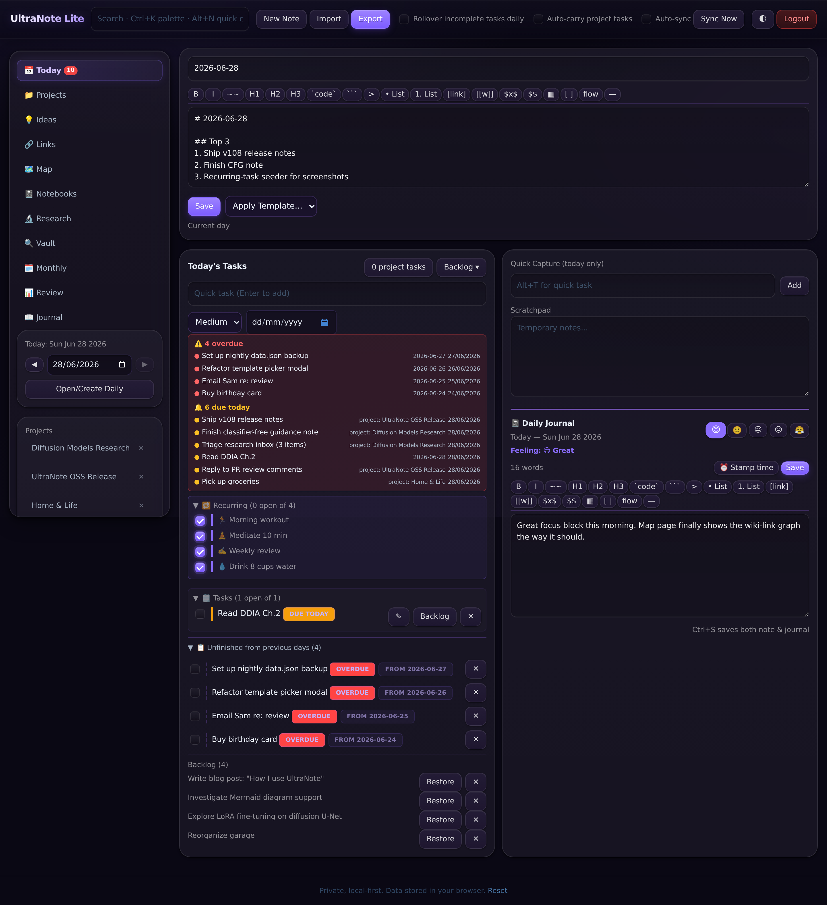<br/>
  <em>Below the active task list: <strong>📋 Unfinished from previous days</strong> (with FROM-date chips and overdue badges) and a per-day <strong>Backlog</strong> parking lot — nothing slips through the crack between days.</em>
</p>

### Quick capture (the killer feature)

<p align="center">
  
</p>

Hit `Alt+N` on desktop or tap the purple `+` FAB on mobile. A focused input pops up with a tiny legend below it:

| Prefix | Goes to |
|---|---|
| `!buy milk` | 🎯 Today, high-priority task |
| `.water plant` | 🎯 Today, normal task |
| `>thought worth a full note` | New note in 💡 Ideas |
| `j felt productive` | Appended to today's `## Journal` section |
| `#research arxiv link` | 💡 Idea tagged `research` |
| `random thought` _(no prefix)_ | 💡 Ideas Vault |

No mode switching, no menus. One keystroke decides everything.

### 🔬 Research mode

<p align="center">
  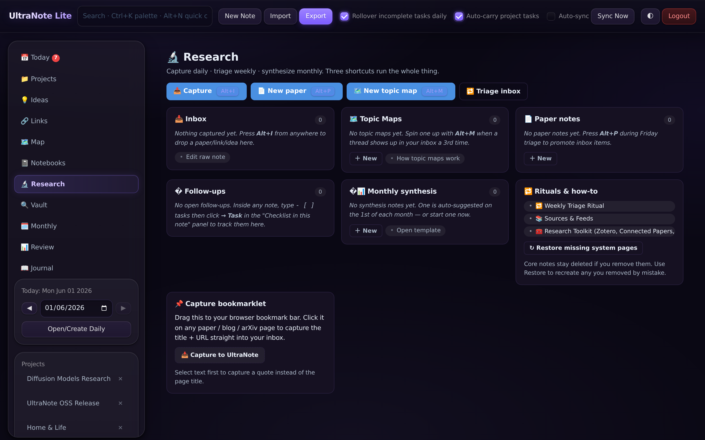
</p>

A capture-first inbox for things you stumble on while reading.

- **Bookmarklet**: drag to your browser's bookmark bar — clicking it on any page silently appends `[timestamp] page title — URL` to your **📥 Research Inbox**. The same tab is reused so you don't pile up windows.
- **`?capture=<text>` URL endpoint**: works with iOS/Android share sheets, automation tools, anything that can hit an HTTP URL.
- **arXiv auto-parser**: pasting an arxiv.org link parses title, authors, abstract, categories, and saves a structured note ready to triage.
- **Topic-map picker**: file an inbox item into an existing project topic, or create a new one in the same modal. Choice is remembered.
- **Undo toast**: every file action shows an interactive toast with an **Unfile** button for 8 seconds — restores both the item and any cleaned-up bullet line.
- **Status pills** on notes: `📥 Inbox`, `📖 Reading`, `✅ Read`, `✍️ Annotated`, `🔁 Follow up`, `🗄️ Archived`.

### Notebooks, wiki-links, and the Map

<p align="center">
  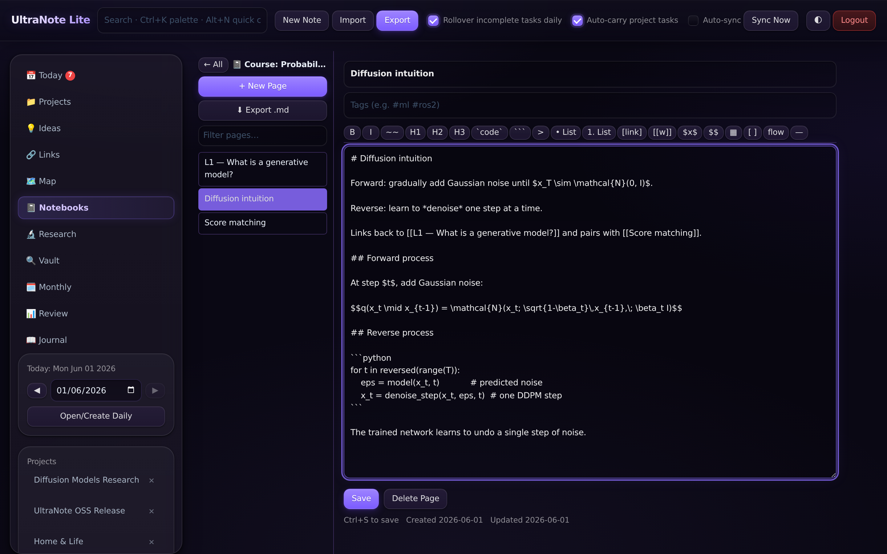
</p>

- **Notebooks** are folders of pages — useful for course notes, books, project journals.
- Anywhere in markdown you can write `[[Another Note]]` or `[[Another Note|shown text]]` and it renders as a real link. Missing notes render in a distinct style so dead links are visible.
- The **🗺️ Map** view shows the graph of `[[wiki-links]]` between notes — collapsible, filterable, with an orphan section.

<p align="center">
  <br/>
  <em>The <strong>Map</strong> resolves every <code>[[wiki-link]]</code> into a real edge — root notes at the top, project-colour chips, connection badges, and an Unlinked section so orphans don't hide.</em>
</p>

### Projects

<p align="center">
  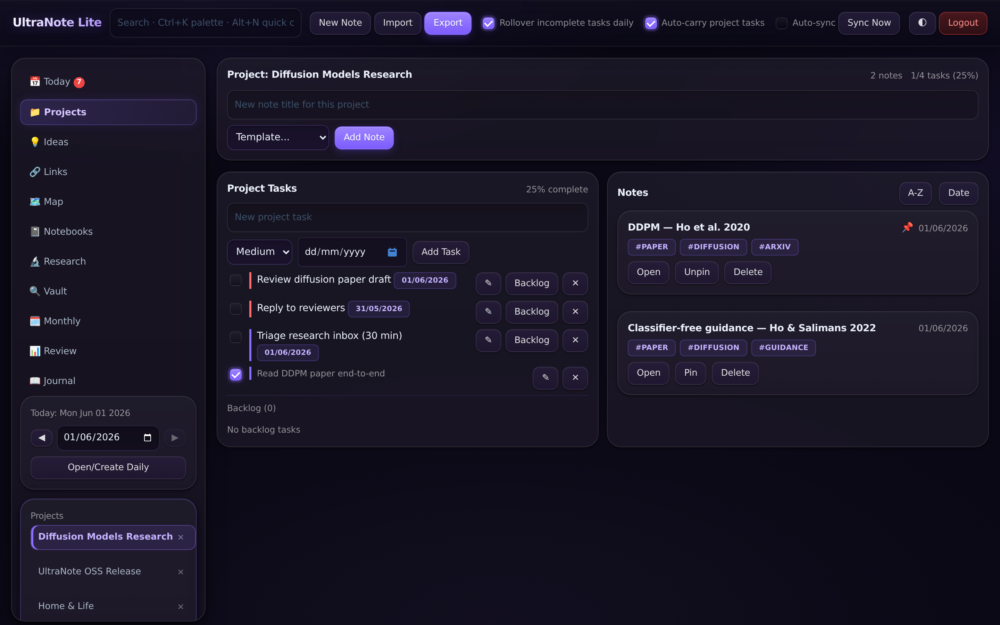
</p>

- Each project gets its own task list and notes pile.
- Custom **templates per project** for new notes.
- Auto-carry incomplete tasks day-to-day (per-project toggle).
- Recurring tasks (daily, weekly, weekdays, monthly, custom day-of-week) — and **duplicate recurring instances are hidden from Pending / Upcoming / palette**, so the lists don't drown in noise.

### 📖 Journal, 🗓 Monthly, 📊 Review

- **Journal** — chronological history view of every `## Journal` block from every daily note, with mood emoji, word count, search, and date filters.
- **Monthly** — the **recurring-task planner**. Define habits or rituals once (every day, weekdays only, specific weekdays, or a single weekday like Sunday) and they materialise as virtual tasks on every matching daily note. Toggling them complete on Today writes a `completions[YYYY-MM-DD] = true` flag straight onto the recurring entry — not a new task per day — which keeps Pending lists clean and lets the Review page reconstruct the full streak.
- **Review** — an analytics dashboard: completion %, day streak, pending-by-priority chart, top project, most productive day, per-project progress bars, **a per-habit ✅ / ❌ / – grid for the current month** (driven by those `completions` flags), and a Research Pulse panel. Soft-deleted notes &amp; tasks live in **Review → Trash** with one-click restore — nothing is ever truly lost until you explicitly purge.

<p align="center">
  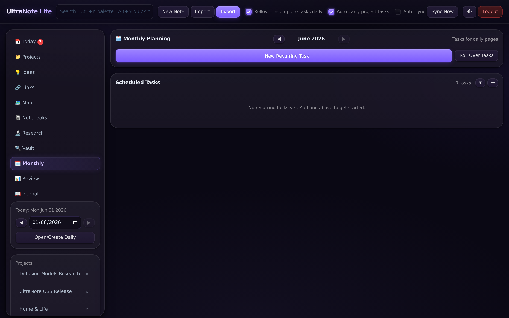
  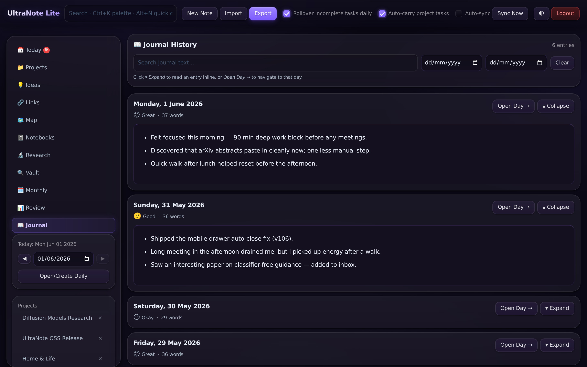<br/>
  <em>Left: <strong>Monthly</strong> — define each habit once with a schedule (every day, Weekdays, Sun-only, …).&nbsp; Right: <strong>Journal</strong> aggregates every daily `## Journal` block with mood, word count, and date filters.</em>
</p>

<p align="center">
  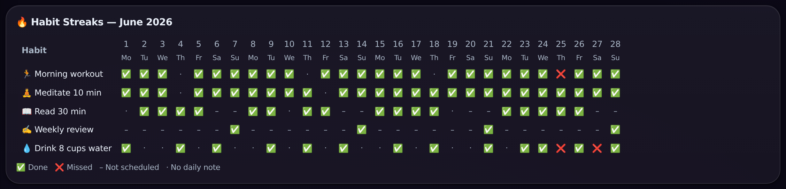<br/>
  <em>The <strong>Habit Streaks</strong> grid on Review walks every recurring entry across the month: ✅ done, ❌ missed, – not scheduled today, · no daily note yet. Skim a row to spot the streak you don't want to break.</em>
</p>

<p align="center">
  <br/>
  <em><strong>Review</strong> in full: completion %, day streak, pending-by-priority, top project / most productive day, per-project progress, the same habit heatmap inline, and Research Pulse.</em>
</p>

### 🔍 Vault & 🔗 Links

<p align="center">
  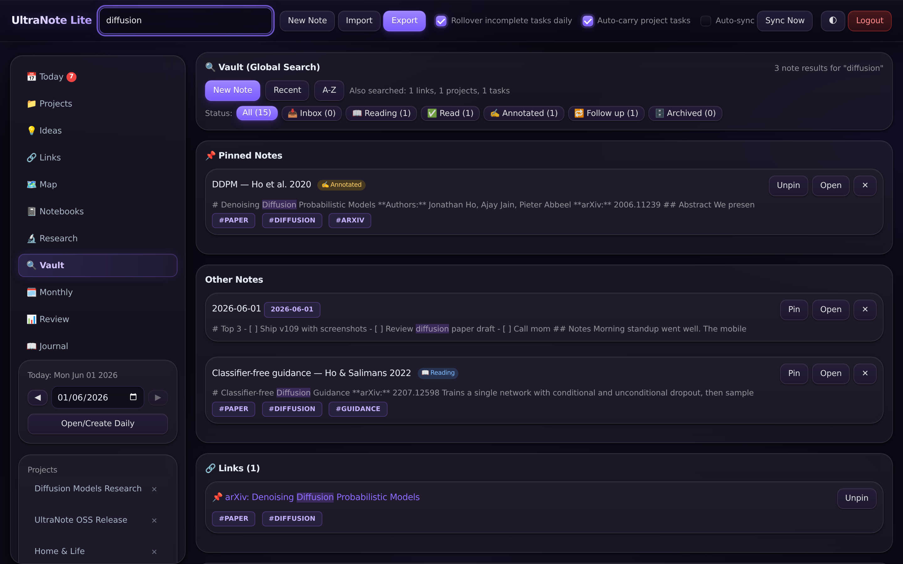
</p>

- **Vault**: a single search box that ranks across all notes, tasks, projects, and links. Tag-aware (`#research`).
- **Links**: bookmarks with tags, pinning, and notes. A lightweight "everything I saved" catalog separate from Research Inbox.

<p align="center">
  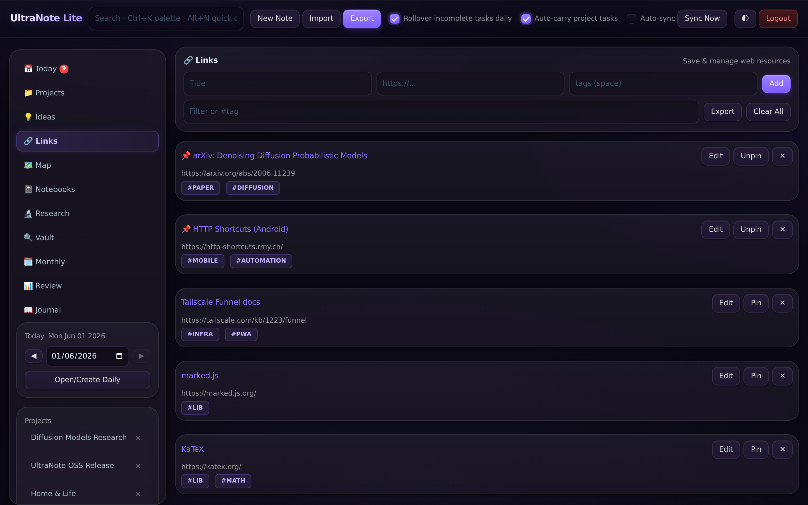<br/>
  <em>The <strong>Links</strong> page: pin the ones you reread, tag for quick filtering, jot a note on why you saved it — inline Edit / Pin / Delete on every row.</em>
</p>

### Editor niceties

- Markdown rendered with [marked](https://marked.js.org/) — toggle preview with `Ctrl+Shift+V`
- Inline `$math$` and block `$$math$$` rendered with **KaTeX**
- Fenced code blocks syntax-highlighted with **highlight.js** (GitHub Dark theme)
- **Sketch canvas** modal — draw with finger/stylus, embed PNG into the note
- **Voice memo** recorder modal — attach audio to a note
- "Saved ✓" inline confirmation on every save (Ctrl+S works everywhere)

### Cross-cutting

- Dark theme with CSS variable theming (light theme via toggle)
- Auto-sync poll keeps two open tabs in agreement
- Service-worker caching for offline browsing
- Versioned cache name so a deploy invalidates the right things

---

## Mobile & phone capture

UltraNote has a real mobile story, not just a "yes it scales down" story.

### What you get on phone

<p align="center">
  
  
  
</p>

- **Bottom nav bar** for the 7 most-used views (Today, Projects, Ideas, Vault, Monthly, Review, Assistant).
- **Side drawer** (☰ top-left) for the full notes list, projects, and tools — auto-closes when you tap outside or pick something.
- **Floating `+` FAB** opens the same prefix-aware quick capture.
- **Browser back button** navigates through your in-app views one step at a time (no more swiping out of the app by accident).
- **Reload preserves your current view** — refreshing while reading note X leaves you on note X, not Today.
- **Install to home screen** — Chrome's `⋮ → Add to Home screen` adds a launcher icon that opens UltraNote in standalone mode.

### One-tap capture from _any_ app on Android

Install [HTTP Shortcuts](https://play.google.com/store/apps/details?id=ch.rmy.android.http_shortcuts) (free, open-source). Create a **Browser Shortcut**:

- **URL**: `http://YOUR_HOST:3366/?capture={{shared}}`
- **Variable** `shared` (Text input type) with **"Allow sharing into this variable"** enabled
- **Triggers → Add to share menu** → bind shared text into `shared`

Now, from any Android app (Chrome, YouTube, Twitter, PDF reader, etc.):

> Tap **Share → UltraNote** → page silently appends to 📥 Research Inbox → swipe back to what you were reading.

That's the same flow as a desktop bookmarklet, but native on phone. (The PWA share-target in `manifest.json` works automatically once you host over HTTPS — see [Going beyond LAN](#going-beyond-lan).)

---

## Quick start

### Prerequisites

- **Node.js ≥ 18**
- **npm**
- (optional but recommended) **pm2** for keeping it running

### Install & run

```bash
git clone https://github.com/tvpian/Ultranote_Lite.git ultranote
cd ultranote
npm install

# Run with a chosen password:
APP_PASSWORD='choose-something-strong' node server.js

# Open the printed URL (default: http://localhost:3366)
```

That's it for a local trial. Log in with your password, and the Today view will appear with a fresh template.

### Run as a service with PM2

```bash
npm install -g pm2

# Edit ecosystem.config.js and set APP_PASSWORD, then:
pm2 start ecosystem.config.js
pm2 save
pm2 startup        # follow the printed instructions to auto-start on reboot

# Useful:
pm2 logs ultranote
pm2 restart ultranote --update-env
pm2 stop ultranote
```

### Going beyond LAN

For phone access from outside your wifi, or to unlock full PWA install + share-target, you need HTTPS. Easiest paths:

- **[Tailscale](https://tailscale.com)** (free) — install on PC + phone, use the machine's tailnet name. Add **Tailscale Funnel** for free HTTPS.
- **Cloudflare Tunnel** — free, no port-forwarding, HTTPS included.
- **Caddy / nginx reverse proxy** with Let's Encrypt if you have a VPS.

Tell HTTP Shortcuts (or regenerate the bookmarklet from the Research dashboard) with the new HTTPS host instead of the LAN IP and you're done.

---

## Configuration

Set in `ecosystem.config.js` (or as environment variables when launching directly):

| Variable | Default | Purpose |
|---|---|---|
| `APP_PASSWORD` | `change-me` | Login password. **Change this.** |
| `PORT` | `3366` | HTTP port |
| `NODE_ENV` | — | `production` recommended |

IPs in `allowedIps` inside `server.js` skip login (handy for `127.0.0.1` / LAN / VPN).

The session secret currently lives in `server.js` — change it for any deployment beyond personal use.

---

## Data, backups, and the two-repo pattern

All app data is in **one file**: `data.json` in the project root.

- Browser persists to server on every change.
- Backup = copy `data.json` somewhere safe.
- Restore = stop server, replace `data.json`, restart.
- `data.json` is **`.gitignore`d** — never committed to the source repo.

### Recommended: separate backup repo + nightly cron

Keep code and data in two repositories. The included `backup.sh` commits `data.json` to a separate private repo on a schedule.

1. **Create a second private repo** for your data (e.g. `ultranote-data`).
2. **Generate a deploy key**:
   ```bash
   ssh-keygen -t ed25519 -C "ultranote-backup" -f ~/.ssh/ultranote_backup -N ""
   ```
3. **Add the public key** as a Deploy Key (with write access) on the data repo.
4. **Tell SSH to use it** in `~/.ssh/config`:
   ```
   Host github-backup
     HostName github.com
     User git
     IdentityFile ~/.ssh/ultranote_backup
   ```
5. **Clone the data repo** to a known location:
   ```bash
   git clone git@github-backup:YOU/ultranote-data.git ~/.local/share/ultranote-data
   ```
6. **Edit `backup.sh`** to point at your paths, then schedule it:
   ```bash
   crontab -e
   # 0 0 * * *  /path/to/ultranote/backup.sh >> /path/to/ultranote/backup.log 2>&1
   ```

Now you have versioned history of every change to your notes, separate from the code, restorable to any past day.

---

## Keyboard shortcuts

| Shortcut | Where | Action |
|---|---|---|
| `Alt+N` | Anywhere | Quick capture popup |
| `Ctrl+K` | Anywhere | Fuzzy command palette |
| `Ctrl+S` | Any editor | Save current note / page / draft |
| `Ctrl+Shift+V` | Note editor | Toggle markdown preview |
| `Alt+I` | Anywhere | Inbox capture modal (Research) |
| `Enter` | Task quick-add | Add task |
| `Esc` | Modals & panels | Close |
| `Ctrl+L` | Anywhere | Log out |

---

## Architecture

### Stack

- **Backend**: Node.js + Express 5, `express-session` + `session-file-store`
- **Frontend**: vanilla HTML/CSS/JS — no React, no build step, no bundler
- **Rendering libs (CDN)**: marked, highlight.js, KaTeX
- **Persistence**: a single `data.json` file (atomic write on save)
- **Sync**: client polls `/api/db` and reconciles into in-memory state; service worker caches static assets

### Files

| File | Purpose |
|---|---|
| `server.js` | Express server: static files, `/api/db`, login, sessions, IP allowlist |
| `index.html` | HTML shell — header, main grid, modals, bottom mobile bar, FAB |
| `app.js` | All client-side state & rendering — every view, every modal, every keyboard handler |
| `styles.css` | Theme tokens, responsive layout, mobile drawer + FAB, component styles |
| `sw.js` | Service worker — versioned offline cache |
| `manifest.json` | PWA manifest (install + share-target) |
| `autosync.js` | Cross-tab polling sync layer |
| `research-mode.js` | Research dashboard, bookmarklet, `?capture=` handler, arXiv parser, topic-map picker |
| `ui-extras.js`, `ui-polish.js` | Command palette, polish details, mobile niceties |
| `editor-extras.js` | Editor toolbar, wiki-link autosuggest, etc. |
| `power-features.js` | Advanced shortcuts, sketch/voice modals, integrations |
| `ecosystem.config.js` | PM2 process definition |
| `backup.sh` | Nightly `data.json` → private repo committer |
| `quotes.json` | Random quote shown on the login screen |

### Versioned cache pattern

Every deploy that changes a front-end file bumps the `CACHE` constant in `sw.js`. Old caches are evicted on activate. Users get the new build on next reload — no manual hard-refresh required.

---

## Data model

```jsonc
{
  "notes": [{
    "id": "string", "title": "string", "content": "string",
    "type": "daily | note | idea",
    "dateIndex": "YYYY-MM-DD",          // daily notes only
    "projectId": "string | null",
    "notebookId": "string | null",
    "tags": ["string"], "pinned": false,
    "status": "inbox | reading | read | annotated | followup | archive | null",
    "createdAt": "ISO", "updatedAt": "ISO", "deletedAt": "ISO | null"
  }],
  "tasks": [{
    "id": "string", "title": "string",
    "status": "TODO | DONE | BACKLOG",
    "noteId": "string | null", "projectId": "string | null",
    "due": "YYYY-MM-DD | null",
    "priority": "high | medium | low",
    "recurring": { "freq": "daily|weekly|weekdays|monthly|custom", "days": [] } | null,
    "subtasks": [{ "title": "string", "done": false }],
    "description": "string",
    "createdAt": "ISO", "completedAt": "ISO | null", "deletedAt": "ISO | null"
  }],
  "projects":  [{ "id": "string", "name": "string", "createdAt": "ISO" }],
  "notebooks": [{ "id": "string", "name": "string", "system": false, "createdAt": "ISO" }],
  "pages":     [{ "id": "string", "notebookId": "string", "title": "string", "content": "string" }],
  "links":     [{ "id": "string", "title": "string", "url": "string", "tags": [], "pinned": false }],
  "templates": [{ "id": "string", "name": "string", "content": "string" }],
  "monthly":   { /* monthly plan storage */ },
  "settings": {
    "rollover": true,
    "autoCarryTasks": false,
    "dailyTemplate": "string",
    "theme": "dark"
  }
}
```

---

## API

All endpoints require an authenticated session, or a whitelisted IP.

| Method | Endpoint | Description |
|---|---|---|
| `GET`  | `/api/db` | Returns the full database as JSON |
| `POST` | `/api/db` | Replaces the database with the posted JSON body |
| `GET`  | `/?capture=<text>` | Silently appends `text` to 📥 Research Inbox |
| `GET`  | `/?qc=<text>` | Opens quick-capture pre-filled with `text` |
| `GET`  | `/login` | Login page |
| `POST` | `/login` | Submit password |
| `GET`  | `/logout` | Clear session and redirect to login |

---

## Security

- **Do not** expose this directly on a public IP without HTTPS and a reverse proxy.
- `/api/db` is a full overwrite — there is no field-level validation, it trusts authenticated sessions.
- **5 failed logins → 2-minute lockout** per IP. Session lifetime: 24 hours.
- Change the session secret in `server.js` before deploying anywhere shared.
- The password is stored in `ecosystem.config.js` / env — not in `data.json`.

---

## Troubleshooting

| Symptom | Likely cause | Fix |
|---|---|---|
| Port 3366 already in use | Previous instance running | `lsof -i :3366` → kill PID, or change `PORT` |
| Code changes not appearing | Old service-worker cache | Bump `CACHE` in `sw.js`, restart, reload |
| Data not saving | `data.json` permission / disk full | `pm2 logs ultranote` |
| Login loop | Cookies disabled / session store corrupt | Clear `.sessions/`, restart |
| "Add to Home screen" missing on phone | Manifest not loaded / not over HTTPS | Hard reload; for full PWA install you need HTTPS |
| Share-sheet capture lands on page but inbox stays empty | Shortcut is silent HTTP, not a Browser Shortcut | Change shortcut type to **Browser Shortcut** so the URL opens in Chrome |
| Auto-sync seems stale | Tab in background, polling paused | Refocus or toggle "Auto-sync" off/on |
| Recurring task appears 30× in Pending | (Pre-v101 bug) Materialized duplicates | Pull latest — v101+ dedups automatically |

---

## Contributing

PRs and issues are welcome — see the [Status & scope](#ultranote) note above for the kinds of changes that fit.

This started as a personal project. If you want to hack on it:

1. Fork and clone
2. `npm install`
3. Run with `APP_PASSWORD=dev node server.js`
4. Edit `app.js` / `styles.css` / `index.html` — refresh browser (no build step)
5. After any front-end change, **bump `CACHE` in `sw.js`** so the service worker picks it up

### Reproducing the docs

The repo ships two helper scripts so the screenshots and hero GIF are reproducible:

```bash
cp data.json /tmp/data.json.bak           # back up your real data
node scripts/seed-demo.js                 # write a rich demo data.json
node scripts/capture-screenshots.js       # regenerate every PNG + 00-hero.gif
cp /tmp/data.json.bak data.json           # restore
```

First-time prereqs:

```bash
npm install --no-save playwright ffmpeg-static
npx playwright install chromium
```

### House rules

- The codebase deliberately avoids frameworks and build steps — please keep that property. PRs that introduce React, bundlers, transpilers, or design systems will be politely declined.
- Vanilla DOM is fine. Long files are fine. Keep features small and self-contained where possible.
- Describe _why_ in commit message bodies, not just _what_.

---

## License

MIT — Copyright (c) 2025–present Tharun V Puthanveettil

Free to use, modify, fork, and self-host. If you build something interesting on top, I'd love to hear about it.
